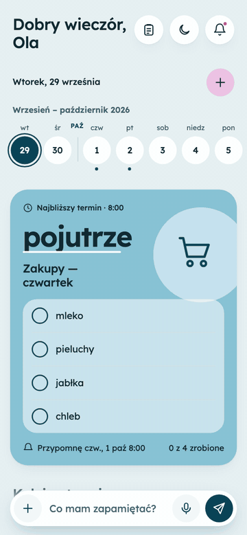
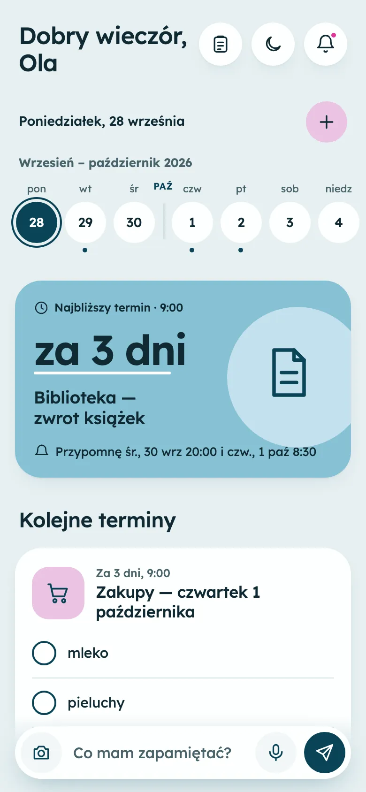
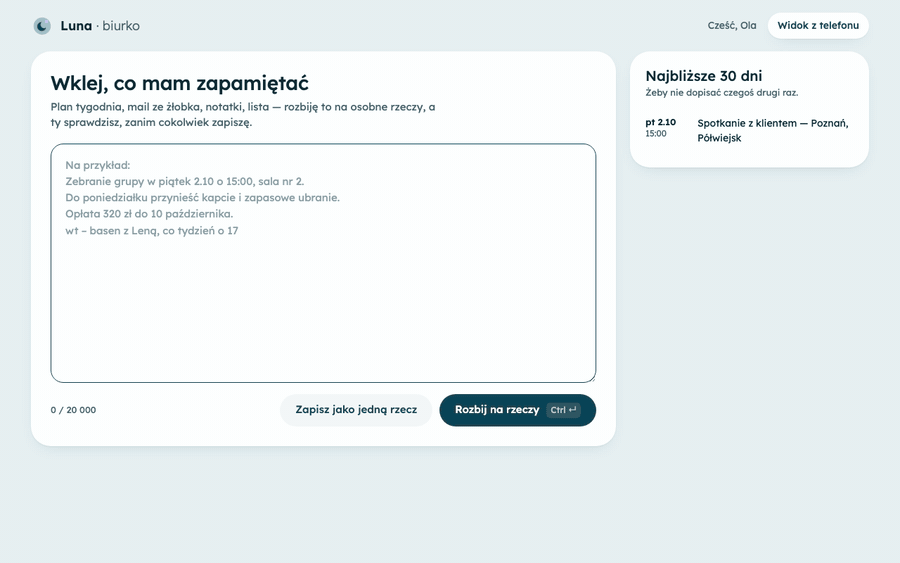
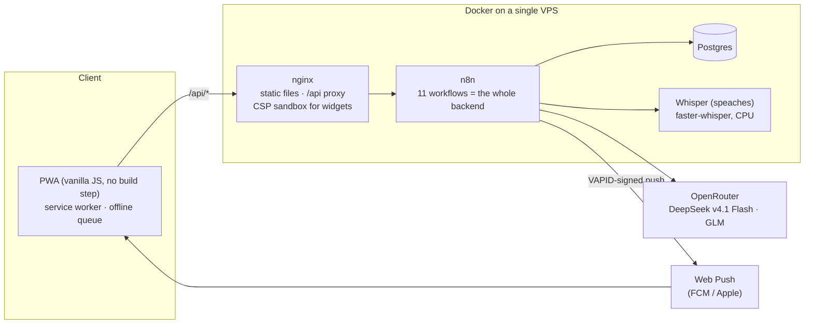

# Luna — a private assistant you talk to in plain Polish

> **PL:** Luna to prywatna asystentka (PWA): piszesz, mówisz albo wklejasz zwykłym zdaniem, co masz zapamiętać, a ona sama
> ustawia terminy, przypomnienia, listy i notatki, i odzywa się pushem, kiedy trzeba. Cały backend to workflowy n8n
> generowane z kodu (Python), modele przez OpenRouter, a rozpoznawanie mowy działa na naszym serwerze (Whisper).
> Interfejs i prompty są po polsku. Szczegółowy dziennik decyzji: [`docs/NOTATKI.md`](docs/NOTATKI.md).

Luna turns sentences like *"on Friday at 3 pm I have a client meeting in Poznań, remind me an hour and a half before so I can
get there, and tell me to take the contract"* into a scheduled item with sensible reminders, a checklist and a push
notification — no forms, no fields. It runs in production for a small group of users at
[luna.draminski.dev](https://luna.draminski.dev) (access on request).

<p>
  
  &nbsp;
  
</p>

## What it does

- **Natural-language capture** — one text field. An LLM decides what the sentence is (one-off reminder, recurring task,
  list, note, page to watch) and fills a structured spec; code, not the model, computes dates and occurrences.
- **Reminders that think about your day** — if you have to travel somewhere, Luna reminds you 1.5 h and 5 min before;
  for a phone call 10 min before; for tomorrow's events also the evening before. At the moment of the event an
  **alarm** pushes 5 times every 20 s, then 5 times every 2 minutes (or until you snooze, dismiss or tick it off), and
  one e-mail says the event has started.
- **Dictation** — tap the mic, speak, tap *Done*. Audio goes to a self-hosted Whisper (`large-v3-turbo`, CPU), is never
  stored, and the sheet shows *what I heard* and *what I did with it* with a one-tap **Undo**.
- **Desk** (`/biurko`) — a desktop page for long material: paste an e-mail from the nursery or a weekly plan, Luna
  splits it into self-contained items with absolute dates, you review and edit, then everything is saved in one go.
- **Photos** — snap a poster or a receipt; a vision model reads it and the regular pipeline decides whether it is an
  event, a list or a note. Only a thumbnail is kept.
- **Looks things up** — "what time is the match on TV, remind me 10 minutes before" triggers a web search and a second
  pass of understanding with the facts found (sources shown on the card).
- **Watches web pages** — summarises a page on a schedule and pushes only when something important changed.
- **Generative widgets** — every card is a widget; built-in parts cover most needs, and when they don't, a model writes
  a new widget from the design tokens. Widgets run in a sandboxed iframe (see *Security*).
- **"Fix it" chat** — talk to Luna about one item; she proposes a plan of changes and applies them all at once.
- **Daily / weekly report**, nudges about overdue items, soft delete with a 30-day bin and *Undo*.
- **Works offline** — last state is cached, new entries queue up and send themselves when the connection returns.

<p>
  
</p>

## Architecture



**Backend without a backend.** Every API route is an n8n webhook; scheduling, e-mail, push, model calls and backups are
n8n workflows too. nginx only serves the static app and proxies `/api/*` to n8n over the internal Docker network.

**Workflows as code.** The workflows are not clicked together in the editor — each one is generated by a Python builder
in [`n8n/`](n8n/) (`build_*.py`), with prompts as `.txt` files and the JavaScript of Code nodes as `.js` files. That gives
readable diffs, reviewable prompts and reproducible deployments. `python3 n8n/build_all.py --public` produces the
importable JSON in [`n8n/workflows/`](n8n/workflows/).

**Models do language, code does arithmetic.** The model gets a pre-computed calendar (dates, weekdays, DST offsets) and
may only use those dates; its JSON output is validated and normalised in code (`n8n/walidacja.js`) before anything is
written. Recurrences, reminder times in the UI and reports are computed deterministically.

| Workflow | Role |
|---|---|
| `Oboe: API` | all app routes: items, lists, photos, research, "fix it" chat |
| `Oboe: Harmonogram` | every 20 s: due reminders and alarms → Web Push (VAPID JWT signed in n8n), e-mail fallback |
| `Oboe: Dyktowanie` | audio → self-hosted Whisper with VAD → text |
| `Oboe: Biurko` | long material → list of self-contained items (nothing saved until reviewed) |
| `Oboe: Generuj widget` | pick from library → write code → static scan → guardian model → versioned file |
| `Oboe: Streść stronę` | fetch & summarise watched pages, SSRF-safe |
| `Oboe: Raport` | daily / weekly plan and overdue nudges |
| `Oboe: Dostęp`, `Oboe: Wydaj token` | request access → admin approval → key by e-mail |
| `Oboe: Limit klucza`, `Oboe: Kopia zapasowa` | model spend alerts; nightly export to private object storage |

## Security notes

- **Passwordless, hashed tokens.** Access keys are sent by e-mail only and never returned over HTTP; the database stores
  `sha256` of each token. New accounts need admin approval; requests are rate-limited.
- **AI-generated code is untrusted.** Widgets are served from a path with `Content-Security-Policy: sandbox allow-scripts;
  connect-src 'none'` and rendered in `<iframe sandbox="allow-scripts">`: an opaque origin with no cookies, storage, network
  or access to the app. Before a widget is published it passes a static scan and a separate "guardian" model review.
- **Prompt injection.** Web pages, search results, photos and pasted material are passed to models explicitly as *data*;
  the models have no tools that could act on instructions found there, and rendered text is escaped.
- **SSRF.** The page fetcher resolves DNS itself (DoH, A + AAAA), allows only public IPs and ports 80/443, and follows at
  most one redirect after re-checking it.
- **Minimal exposure.** Postgres and Whisper are reachable only on the internal Docker network, and the app talks to n8n
  over that network too — so Luna's webhooks are blocked on n8n's public hostname and exist only behind the app's proxy.
  Admin routes are blocked at the proxy and additionally require a header secret. Voice recordings and full-size photos
  are never stored.
- **Cost guard.** Everything runs on one model key with a spend limit (alerts at 80/95/100 %). New accounts get a daily
  limit of model-backed actions (`db/014`), checked in the same query that authenticates the request — before any paid call.

## Repository layout

```
public/        PWA: index.html, app.js, api.js, sw.js, biurko.* (desk page), fonts & icons
n8n/           workflow builders (build_*.py), prompts (prompt-*.txt), Code-node JS, config
n8n/workflows/ generated, importable n8n workflow JSON (placeholder credentials)
db/            Postgres schema and migrations
infra/         example docker-compose (app, n8n, Postgres, Whisper) and .env.example
docs/          development notes (Polish) and screenshots
nginx.conf     static files, /api proxy, per-route body limits, widget CSP
```

## Running it yourself

1. `cp infra/.env.example infra/.env`, fill it in, then `docker compose -f infra/docker-compose.yml up -d`.
2. Apply `db/*.sql` migrations in order and mark yourself as admin (see `db/008-prosby-o-dostep.sql`).
3. In n8n create credentials: Postgres (`oboe-db`), OpenRouter, SMTP, Header Auth (`X-Admin-Token`) and a Crypto
   credential holding your VAPID private key. Put their IDs and your URLs into `n8n/config.local.json`
   (copy of `config.example.json`), then `cd n8n && python3 build_all.py` and import the generated `oboe-*.json`
   (or import `n8n/workflows/*.json` and pick the credentials in the editor).
4. Put your VAPID public key in `public/api.js`, pull the Whisper model once (command in the compose file), expose only
   the `luna` service over HTTPS.

## Stack

Vanilla JavaScript PWA (no framework, no bundler) · nginx · n8n · PostgreSQL 16 · OpenRouter (DeepSeek v4.1 Flash for
understanding, vision and web search; GLM for widget code) · faster-whisper via speaches · Web Push with VAPID ·
Docker · Cloudflare Tunnel.

## Try it

Luna is live at **[luna.draminski.dev](https://luna.draminski.dev)** (Polish UI). Enter your name and e-mail — I approve
access requests by hand, usually the same day, and the access key arrives by e-mail. It works best installed on the home
screen (iOS: *Share → Add to Home Screen*) with notifications on; on a computer try **[/biurko](https://luna.draminski.dev/biurko)**.

It is a private instance on a single model key, so test accounts have a small daily limit — and please don't put anything
sensitive in it. By requesting access you accept the [terms and privacy notice](https://luna.draminski.dev/regulamin) (Polish).

---

The user-facing name is **Luna**; technical identifiers (`oboe`, workflow names, DB) keep the original working name on
purpose — renaming the internals would be risk without benefit.
